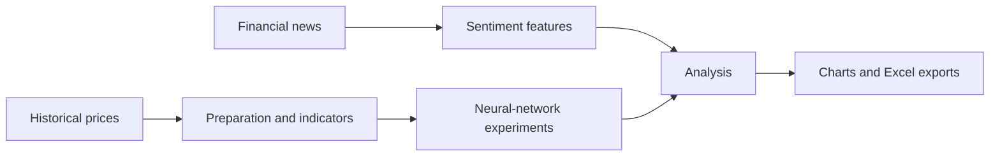

<div align="center">

**Market data. News sentiment. Deep learning.**

Python · TensorFlow / Keras · pandas · Yahoo Finance · VADER

[Portfolio](https://harshil-prashant-shah.vercel.app/) · [LinkedIn](https://www.linkedin.com/in/harshilpshah/) · [Explore the code](#repository-guide)

</div>

---

## What this project explores

How do historical prices and financial-news sentiment contribute to stock-analysis experiments? FinWizard brings together market-data retrieval, technical indicators, neural-network models, and visual comparisons.

### Inside the notebook

- Download historical price series through `yfinance`.
- Calculate moving averages and experimental trading signals.
- Prepare sequential inputs for LSTM, CNN, and RNN experiments.
- Analyze news sentiment using News API and VADER.
- Plot predictions and export selected results to Excel.

## Workflow



## Run locally

Requires Python and internet access. TensorFlow availability depends on your Python version and platform.

```bash
python -m venv .venv
source .venv/bin/activate
pip install -r requirements.txt
jupyter lab notebooks/finwizard.ipynb
```

On Windows, activate with `.venv\Scripts\activate`. For the news experiment, set `NEWS_API_KEY` in your environment before starting Jupyter. `.env.example` lists the setting; the notebook does not automatically load `.env` files.

## Repository guide

- `notebooks/finwizard.ipynb` — original research experiments, with outputs cleared.
- `requirements.txt` — dependencies inferred from imports.
- `.env.example` — credential placeholder.

## Reproducibility notes

The notebook contains successive experiments and repeated function definitions. Read each experiment before running it; later definitions can replace earlier ones. Several experiments use historical date windows that should be checked before re-running. Market-data availability can change.

The uploaded stock archive contains reference papers, not a fixed market-data snapshot. Model training and reported performance have not been independently reproduced. Predictions and buy/sell/hold signals are experimental outputs, not established trading performance.

## Research

[Read the associated paper or manuscript](https://www.taylorfrancis.com/chapters/edit/10.1201/9781003773504-127/stock-market-prediction-using-news-api-deep-learning-algorithms-harshil-shah-dhvani-shah-dharmil-parekh-janhavi-patel-richa-sharma). This reference was supplied by the author; publisher or Drive access conditions may apply. The paper and this repository may represent different project stages.

## About the author

**Harshil Prashant Shah** · MS in Management Information Systems, Texas A&M University.

[Portfolio](https://harshil-prashant-shah.vercel.app/) · [LinkedIn](https://www.linkedin.com/in/harshilpshah/) · [GitHub](https://github.com/harshilshah250504)

## Data and reuse

Local datasets, credentials, and third-party research PDFs are not included. No blanket license is granted over third-party material. Refer to the original sources for their terms before redistributing data or publications.

## Execution check

See [validation notes](VALIDATION.md) for the model smoke check and remaining evaluation limitations.
